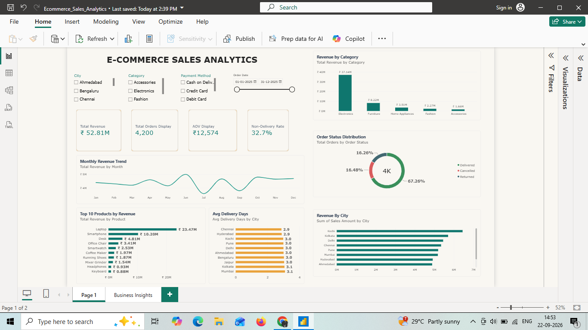
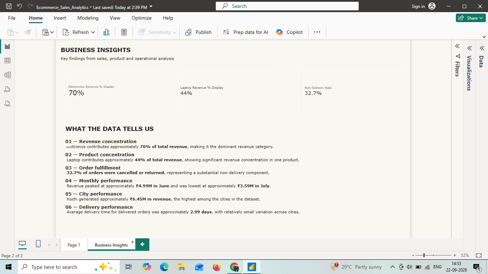

# 📊 E-Commerce Sales Analytics Dashboard

An end-to-end data analytics project that analyzes e-commerce transactional data to understand sales performance, product contribution, order fulfillment, city performance, and delivery operations.

The project follows a practical analytics workflow:

**Raw Data → Data Cleaning → Exploratory Data Analysis → DAX → Power BI Dashboard → Business Insights**

---

## 📌 Project Overview

The objective of this project is to transform raw e-commerce transaction data into an interactive Power BI dashboard and derive meaningful business insights from the data.

The analysis focuses on:

- Sales performance
- Product and category contribution
- Customer orders
- Order fulfillment
- City-wise performance
- Payment methods
- Delivery performance
- Monthly revenue trends

---

## 🛠️ Tools & Technologies

- **Python**
- **Pandas**
- **Power BI**
- **DAX**
- **CSV**
- **Data Visualization**

---

## 🔄 Data Preparation

The raw transactional dataset was cleaned and validated using Python and Pandas.

### Key cleaning steps

- Removed duplicate records
- Handled missing customer and payment information
- Standardized city names
- Validated numerical fields
- Validated and corrected inconsistent sales amounts
- Converted order dates into proper date format
- Preserved business-relevant missing delivery values for cancelled and returned orders

The cleaned dataset contains **4,201 transaction rows representing 4,200 unique orders**.

---

## 📈 Key Performance Indicators

| KPI | Value |
|---|---:|
| Total Revenue | ₹52.81M |
| Total Orders | 4,200 |
| Average Order Value | ₹12,574 |
| Cancelled + Returned Orders | 32.7% |

---

## 📊 Power BI Dashboard

The interactive dashboard includes:

- KPI cards
- Monthly revenue trend
- Revenue by city
- Revenue by category
- Top 10 products by revenue
- Order status distribution
- Average delivery days by city
- Interactive slicers for city, category, payment method and order date

### Dashboard Overview



---

## 💡 Business Insights

### 1. Revenue Concentration

Electronics contributed approximately **70% of total revenue**, making it the dominant revenue category.

### 2. Product Concentration

Laptop contributed approximately **44% of total revenue**, indicating significant revenue concentration in a single product.

### 3. Order Fulfillment

**32.7% of orders were cancelled or returned**, representing a substantial non-delivery component.

### 4. Monthly Performance

Revenue peaked at approximately **₹4.99M in June** and was lowest at approximately **₹3.59M in July**.

### 5. City Performance

Kochi generated approximately **₹6.45M in revenue**, the highest among the cities in the dataset.

### 6. Delivery Performance

Average delivery time for delivered orders was approximately **2.99 days**, with relatively small variation across cities.

---

## 📷 Business Insights Page



---

## 🧮 DAX Measures

Some of the key Power BI measures used in the analysis include:

### Total Revenue

```DAX
Total Revenue = SUM('ecommerce_sales_cleaned'[Sales Amount])

Total Orders = DISTINCTCOUNT('ecommerce_sales_cleaned'[Order ID])
AOV = [Total Revenue] / [Total Orders]
Non-Delivery Rate =
DIVIDE(
    CALCULATE(
        [Total Orders],
        'ecommerce_sales_cleaned'[Order Status] IN {"Cancelled", "Returned"}
    ),
    [Total Orders]
)
